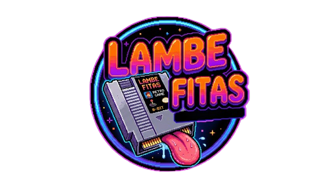

<p align="center">
  
</p>

<h1 align="center">Lambe Fitas - Retrô Games</h1>

<p align="center">
  Plataforma de emulação de jogos retrô diretamente no navegador.<br/>
  Reviva a era dourada dos videogames com acervo completo de Mega Drive / Nintendo / Super Nintendo / Master-System.
</p>

---

## Sobre

**Lambe Fitas - Retrô Games** é uma plataforma web que permite jogar clássicos de diversos video-games diretamente no navegador, sem necessidade de instalação ou download. A emulação é feita via EmulatorJS (WebAssembly), garantindo compatibilidade e performance no browser.

### Consoles Suportados

| Console | Fabricante | Ano | Status |
|---------|-----------|-----|--------|
| Mega Drive | Sega | 1988 | Disponível |
| Master System | Sega | 1986 | Em breve |
| NES | Nintendo | 1983 | Em breve |
| Super Nintendo | Nintendo | 1990 | Em breve |

---

## Funcionalidades

- **658+ jogos** de Mega Drive catalogados com metadados completos
- **Emulação no navegador** via EmulatorJS (WebAssembly)
- **Capas de jogos** em estilo cartucho com prateleira de madeira
- **Curiosidades e controles** de cada jogo documentados
- **Busca por título** para encontrar jogos rapidamente
- **Paginação** do acervo (24 jogos por página)
- **Layout responsivo** para desktop e mobile
- **Tema retrô** com efeitos neon, scanlines e gradientes

---

## Tecnologias

| Camada | Tecnologia |
|--------|-----------|
| Frontend | Next.js 14, React 18, TypeScript |
| Estilo | Tailwind CSS 3.4 |
| Backend | FastAPI (Python 3), Uvicorn |
| Emulação | EmulatorJS (WebAssembly CDN) |
| Assets | Next.js Image (otimização automática) |

---

## Estrutura do Projeto

```
videogames_retro/
├── frontend/                    # Aplicação Next.js
│   ├── public/
│   │   ├── emulator.html        # Iframe do emulador EmulatorJS
│   │   ├── bg.png               # Plano de fundo da aplicação
│   │   ├── favicon.gif          # Favicon animado (logo Lambe Fitas)
│   │   ├── covers/md/           # Capas dos jogos Mega Drive
│   │   └── roms/md/             # ROMs dos jogos Mega Drive
│   └── src/
│       ├── app/
│       │   ├── page.tsx          # Página inicial (seleção de console)
│       │   ├── layout.tsx       # Layout raiz com metadata
│       │   ├── globals.css      # Estilos globais e componentes
│       │   ├── megadrive/       # Página do acervo Mega Drive
│       │   └── play/[id]/       # Página individual do jogo
│       ├── components/
│       │   ├── ConsoleCard.tsx   # Card de console com logo
│       │   ├── GameShelf.tsx    # Prateleira de cartuchos
│       │   └── GamePlayer.tsx   # Player com emulador e informações
│       ├── assets/              # Logos e imagens da aplicação
│       │   ├── logo_lambefitas.png
│       │   ├── logo_lambefitas.gif
│       │   ├── genesis_md_logo.png
│       │   ├── snes_nintendo_logo.png
│       │   ├── nes_nintendo_logo.png
│       │   ├── master-system_sega_logo.png
│       │   └── bg.png
│       └── data/
│           └── gameMetadata.ts  # Metadados de 658+ jogos (título, ano, gênero, curiosidades, controles)
├── backend/                     # API FastAPI
│   ├── main.py                  # Endpoints de listagem de jogos e serving de ROMs/capas
│   └── requirements.txt        # Dependências Python
└── scripts/                     # Scripts auxiliares
    └── match_roms_covers.ps1    # Script de matching ROMs ↔ capas
```

---

## Instalação e Execução

### Pré-requisitos

- **Node.js** 18+
- **Python** 3.10+
- **npm** ou **yarn**

### 1. Clonar o repositório

```bash
git clone https://github.com/seu-usuario/videogames_retro.git
cd videogames_retro
```

### 2. Configurar o Backend

```bash
cd backend
python -m venv venv

# Ativar virtualenv
# Windows:
venv\Scripts\activate
# Linux/Mac:
source venv/bin/activate

pip install -r requirements.txt
uvicorn main:app --host 0.0.0.0 --port 8000 --reload
```

A API ficará disponível em `http://localhost:8000`.

### 3. Configurar o Frontend

```bash
cd frontend
npm install
npm run dev
```

O frontend ficará disponível em `http://localhost:3000`.

### 4. Adicionar ROMs e Capas

Coloque os arquivos nos diretórios correspondentes:

- **ROMs**: `frontend/public/roms/md/` (formatos `.md`, `.bin`, `.smd`, `.gen`)
- **Capas**: `frontend/public/covers/md/` (formato `.png`, nome: `cover_NOMEDAROM.png`)

> Use o script `scripts/match_roms_covers.ps1` para verificar o matching entre ROMs e capas.

---

## API Endpoints

| Endpoint | Descrição |
|----------|-----------|
| `GET /games/megadrive` | Lista todos os jogos de Mega Drive com ID, ROM e capa |
| `GET /roms/{path}` | Serve arquivos de ROM via StaticFiles |
| `GET /covers/{path}` | Serve arquivos de capa via StaticFiles |

---

## Metadados dos Jogos

O arquivo `frontend/src/data/gameMetadata.ts` contém metadados detalhados de 658+ jogos:

```typescript
export interface GameMeta {
  title: string;       // Título do jogo
  year: number;        // Ano de lançamento
  genre: string;       // Gênero (Acao, Plataforma, Tiro, RPG, etc.)
  console: string;     // Console (Mega Drive)
  curiosities: string[]; // Curiosidades e informações sobre o jogo
  controls: { action: string; key: string }[]; // Mapeamento de controles
}
```

---

## Histórico de Atualizações

### v0.1.0 — Maio 2026

- **Branding Lambe Fitas**: Aplicação renomeada de "Video-Games Retrô" para "Lambe Fitas - Retrô Games"
- **Logo personalizado**: Logo Lambe Fitas adicionado como cabeçalho e favicon animado (`.gif`)
- **Plano de fundo**: Imagem `bg.png` aplicada como background cover fixo na aplicação
- **Cards de console com logos**: Emojis coloridos substituídos por logos oficiais (Mega Drive, Master System, NES, Super Nintendo)
- **Página Mega Drive**: Ícone circular azul substituído pela logo do Mega Drive
- **Subtítulo "Escolha o Video-Game:"**: Adicionado abaixo do logo em amarelo neon alinhado à esquerda
- **Footer redesenhado**: Barra roxo escuro neon translúcida com texto branco neon em largura total
- **Acervo expandido**: ROM "Streets of Rage (World) (Rev A)" adicionada com metadados completos
- **Metadados preenchidos**: 658+ jogos com curiosidades, ano de lançamento e controles documentados via API RAWG e Wikipedia
- **Anos corrigidos**: Jogos com anos incorretos (pós-2000) foram corrigidos manualmente para datas reais de lançamento no Mega Drive
- **Descrições genéricas removidas**: Placeholders "Jogo clássico do Mega Drive" e descrições genéricas da Sega foram substituídos por informações reais

---

## Licença

Todos direitos Reservados á Lambe Fitas Games Retrô ©2026
